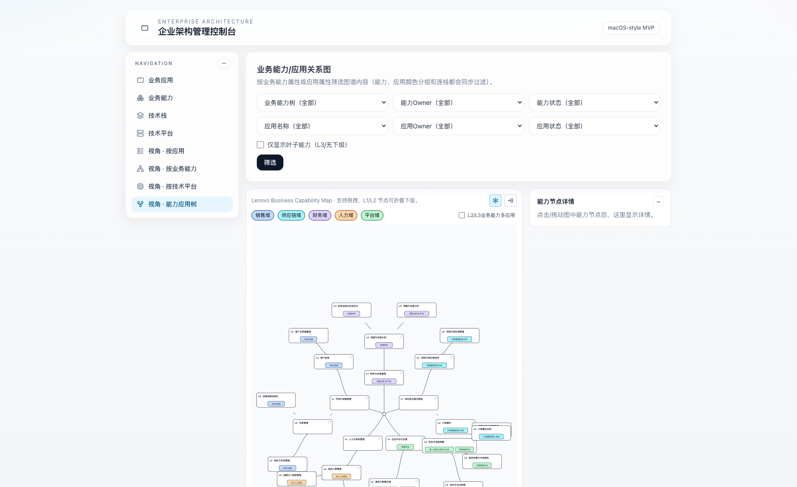

# Enterprise Architecture MVP（企业架构管理系统）

一个面向企业架构梳理的 Web MVP：以“业务能力（Capability）—业务应用（Application）—技术栈（Tech Stack）—技术平台（Platform）”为核心对象，支持主数据管理、关系管理与多视角浏览。

## 关系图示例（复杂业务能力应用 Map）



> 截图页面：`/views/relationship-tree`

## 技术栈

- **Next.js 14**（App Router）
- **TypeScript**
- **PostgreSQL**
- **Prisma ORM**
- 轻量 UI 组件（shadcn/ui 风格）

---

## 快速开始

### 1) 安装依赖

```bash
cd /Users/ruodongyang/.openclaw/workspace-coding/enterprise-architecture-mvp
cp .env.example .env
npm install
```

### 2) 准备数据库

#### 方式 A：Docker（推荐）

```bash
docker compose up -d
```

#### 方式 B：本地 PostgreSQL

手动创建数据库 `ea_mvp`，并在 `.env` 中配置 `DATABASE_URL`。

### 3) 初始化数据

```bash
npx prisma generate
npx prisma migrate dev --name init
npm run prisma:seed
```

### 4) 启动项目

```bash
npm run dev
```

默认访问：<http://localhost:3000>

> 如果 3000 端口被占用，Next.js 会自动切到 3001（或其他端口）。

---

## 项目能力范围（当前）

## 1. 主数据管理（CRUD）

- 业务能力（BusinessCapability）
- 业务应用（BusinessApplication）
- 技术栈（TechStack）
- 技术平台（TechPlatform）

## 2. 关系管理（多对多）

- 业务应用 ↔ 业务能力（ApplicationCapability）
- 业务应用 ↔ 技术栈（ApplicationTechStack）
- 业务应用 ↔ 技术平台（ApplicationTechPlatform）

## 3. 可视化与视角页面

- 按应用查看：`/views/applications`
- 按业务能力查看：`/views/capabilities`
- 按技术平台查看：`/views/platforms`
- 业务能力/应用关系图：`/views/relationship-tree`

关系图支持：

- 星型 / 树形布局切换
- 节点拖拽与位置持久化
- L1/L2 折叠展开
- 域过滤与高亮
- 缩放与平移

---

## 数据模型说明（MVP）

主数据实体统一包含生命周期相关字段：

- `lifecycleStatus`：`PLANNED | ACTIVE | SUNSETTING | RETIRED`
- `createdAt` / `updatedAt`
- `deletedAt`（软删除预留）

业务类实体额外包含：

- `validFrom` / `validTo`

并已为 `lifecycleStatus`、`deletedAt`、关联外键建立索引。

---

## 常用脚本

```bash
npm run dev           # 开发模式
npm run build         # 生产构建
npm run start         # 生产启动
npm run prisma:seed   # 填充示例数据
```

---

## 当前 MVP 边界

- 详情页以关系查看为主，编辑体验仍可继续强化
- 关系维护已覆盖模型层，复杂批量编辑能力可在下一迭代补充
- 权限与审计暂未纳入 MVP（建议后续版本补齐）

---

## 目录参考

```text
app/
  applications/               # 应用管理
  capabilities/               # 业务能力管理
  stacks/                     # 技术栈管理
  platforms/                  # 技术平台管理
  views/                      # 视角页面（含关系图）
  api/capability-positions/   # 节点坐标持久化接口

components/
  capability-application-mindmap.tsx  # 能力/应用关系图核心组件

prisma/
  schema.prisma
  migrations/
  seed.ts
```

---

## 备注

该仓库当前定位为“可演示、可扩展”的 EA 管理 MVP。建议下一阶段优先补充：

1. 关系编辑体验（表单内直接维护关联）
2. 搜索/筛选/分页增强
3. 权限模型与操作审计
4. 测试与部署流水线完善
